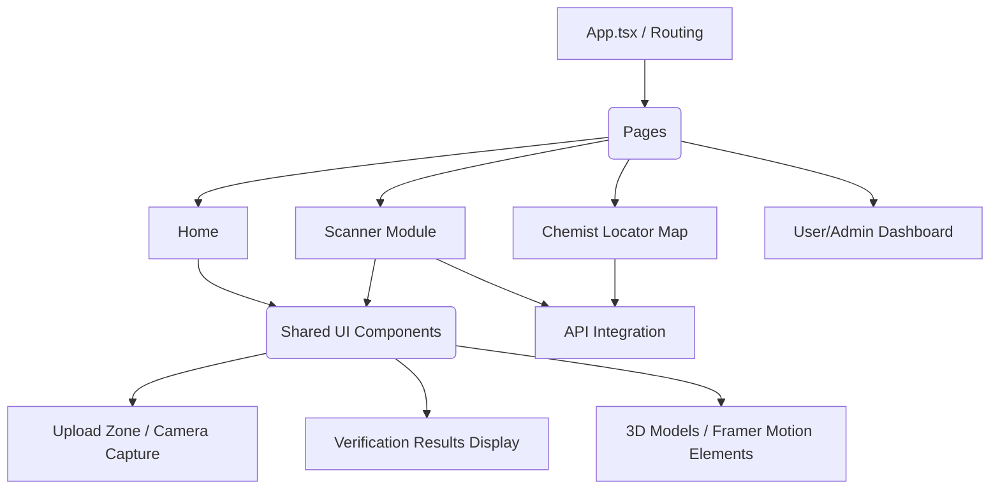

# MediGuard Frontend

The frontend for MediGuard is built with React 18 (Vite) and TailwindCSS, providing a highly interactive, 3D-accelerated user experience focused on scanning, mapping, and user engagement.

## 🏗️ Architecture & Component Flow



---

## 🔌 Connecting APIs to the Frontend

MediGuard uses standard REST conventions combined with Axios and React Hooks to efficiently handle API communication and state management.

### 1. Axios Configuration
Create an Axios instance to centralize configuration, such as setting the base URL and adding auth headers.

```javascript
// src/api/axios.js
import axios from 'axios';

const api = axios.create({
  baseURL: import.meta.env.VITE_API_BASE_URL || 'http://localhost:5000/api/v1',
  headers: {
    'Content-Type': 'application/json',
  },
});

// Add an interceptor to inject the JWT token
api.interceptors.request.use((config) => {
  const token = localStorage.getItem('token');
  if (token) {
    config.headers.Authorization = `Bearer ${token}`;
  }
  return config;
});

export default api;
```

### 2. Creating API Service Layers
Group related endpoints together in a service file.

```javascript
// src/services/reportService.js
import api from '../api/axios';

export const submitReport = async (reportData) => {
  const response = await api.post('/report/submit', reportData);
  return response.data;
};

export const getReportHistory = async () => {
  const response = await api.get('/report/history');
  return response.data;
};
```

### 3. Using React Hooks for State Management
Custom hooks allow components to trigger API calls while automatically tracking loading and error states.

```javascript
// src/hooks/useReport.js
import { useState, useCallback } from 'react';
import { submitReport } from '../services/reportService';

export const useReport = () => {
  const [submitting, setSubmitting] = useState(false);
  const [error, setError] = useState(null);
  const [success, setSuccess] = useState(false);

  const submitFakeReport = useCallback(async (reportData) => {
    setSubmitting(true);
    setError(null);
    try {
      const response = await submitReport(reportData);
      setSuccess(true);
      return response;
    } catch (err) {
      setError(err.response?.data?.message || 'Failed to submit report.');
    } finally {
      setSubmitting(false);
    }
  }, []);

  return { submitting, error, success, submitFakeReport };
};
```

### 4. Implementation in Components
Finally, consume the custom hook inside a functional component.

```javascript
// src/components/ReportForm.jsx
import React from 'react';
import { useReport } from '../hooks/useReport';

const ReportForm = () => {
  const { submitting, error, success, submitFakeReport } = useReport();

  const handleReport = async () => {
    await submitFakeReport({ reason: "Counterfeit visual anomalies" });
  };

  if (success) return <p>Report submitted successfully!</p>;
  if (error) return <p className="text-red-500">{error}</p>;

  return (
    <button onClick={handleReport} disabled={submitting}>
      {submitting ? 'Submitting...' : 'Submit Report'}
    </button>
  );
};

export default ReportForm;
```

---

## 🛠️ Setup & Execution

### Installation
1. Navigate to the Frontend directory:
   ```bash
   cd Frontend
   ```
2. Install dependencies:
   ```bash
   npm install
   ```

### Configuration
Create a `.env` file in the root of the `Frontend` directory with the following variables:
```env
VITE_API_BASE_URL=http://localhost:5000/api/v1
```

### Running the Application
Start the Vite development server:
```bash
npm run dev
```
