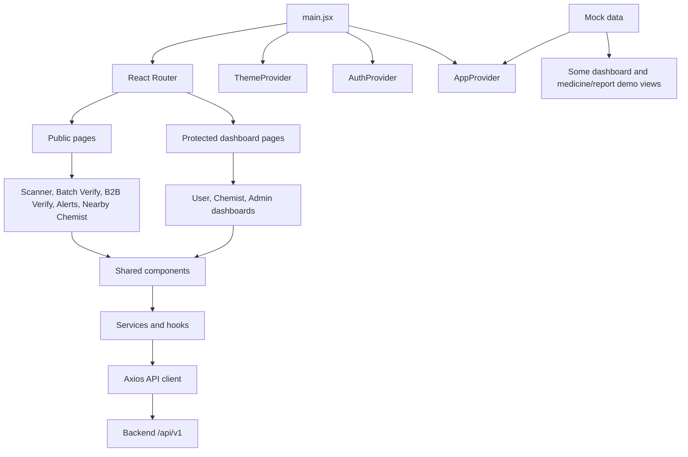

# MediGuard Frontend

This is the React frontend for MediGuard. It gives users the main verification screens: medicine scanning, batch checking, B2B wholesale invoice verification, alerts, nearby chemists, auth, and role-based dashboards.

## Architecture



The app is organized around pages and shared components. `App.jsx` defines the routes, wraps everything with theme/auth/app context providers, and shows the common navbar/sidebar/footer outside the home page.

## Main Folders

```text
Frontend/
  public/          Logo and static visual assets
  src/components/ Shared UI, scanner, medicine, report, dashboard components
  src/context/    Auth, theme, and app-level state providers
  src/hooks/      Location, report, and scanner helper hooks
  src/pages/      Routed screens
  src/services/   Axios API client and feature service functions
  src/utils/      Constants, mock data, helpers, validators, OSM helpers
  src/App.jsx     Main route layout
  src/main.jsx    React entry point
```

## Important Pages

- `/` - home screen
- `/scanner` - upload a medicine image and view AI risk analysis
- `/batch-verify` - check a batch number directly
- `/b2b-verify` - upload/enter GST invoice and medicine batch details for wholesale verification
- `/alerts` - recall/spurious medicine alerts
- `/nearby-chemist` - chemist locator
- `/medicine-info` - medicine information/search view
- `/login`, `/register` - auth screens
- `/dashboard/user` - public user dashboard
- `/dashboard/chemist` - chemist dashboard
- `/dashboard/admin` - admin dashboard
- `/dashboard/history` - protected scan history

## API And State Flow

- `src/services/api.js` creates the shared Axios client using `VITE_API_BASE_URL`.
- Auth tokens are read from `localStorage` and attached to API requests by an Axios interceptor.
- `AuthContext.jsx` stores the logged-in user/chemist state and handles login, register, and logout.
- `ThemeContext.jsx` handles theme state.
- `AppContext.jsx` holds app-level demo data such as alerts, scan history, and reports.
- Scanner and B2B pages call the backend directly through Axios/FormData for file upload flows.

Backend base URL defaults to:

```text
http://localhost:5000/api/v1
```

## Local Setup

Install dependencies:

```bash
cd Frontend
npm install
```

Create `Frontend/.env`:

```env
VITE_API_BASE_URL=http://localhost:5000/api/v1
```

Start the dev server:

```bash
npm run dev
```

Open:

```text
http://localhost:5173
```

Build for production:

```bash
npm run build
npm run preview
```

## Frontend Stack

- React 18 with Vite
- Tailwind CSS
- React Router
- Axios
- Framer Motion
- Leaflet and React Leaflet
- Recharts
- Lucide React
- React Hot Toast
- Three.js and React Three Fiber

## Notes And Limitations

- The scanner and B2B verification screens depend on the backend running locally and having a working `VITE_API_BASE_URL`.
- The full image scanner needs backend AI/upload configuration to be working, especially Groq and Cloudinary.
- Some medicine, report, and dashboard service files still use mock/demo data for presentation flow.
- The B2B verification page is wired to the real `/wholesale/verify` endpoint, but image extraction quality depends on invoice image clarity.
- Protected dashboards depend on the role returned by backend auth: `public`, `chemist`, or `admin`.
