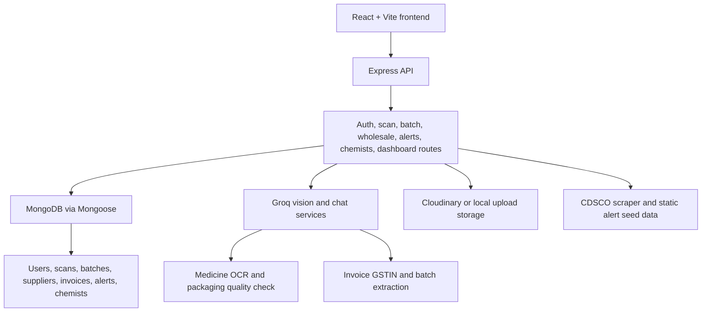

# MediGuard

MediGuard is a medicine verification web app built for the Aminabad wholesale medicine market context in Lucknow. It helps a buyer or chemist check medicine packaging, batch numbers, GST invoice details, supplier records, and recall alerts before purchase. The goal is not to replace lab testing, but to give a fast risk signal at the counter so suspicious stock can be stopped early.

## Team

- Team name: LoneWolf
- Member: Mayank Chaudhary
- GitHub: [qwertyuii7](https://github.com/qwertyuii7)

## Problem Statement

PS-02 - Counterfeit medicine detection in Aminabad wholesale market

Aminabad is UP's largest wholesale medicine hub. Build an agent that cross-checks medicine batch numbers, GST invoices, and supplier databases in real time to flag counterfeit drugs at the point of purchase.

Lucknow context: Aminabad Dawa Bazar

## What The Project Does

- Scans medicine package images and extracts visible medicine details, batch number, expiry, MRP, manufacturer, and packaging quality signals.
- Checks extracted or manually entered batch numbers against recalled and under-investigation batch records.
- Provides a B2B wholesale verification flow where invoice image/manual GSTIN, invoice number, and medicine batch are checked together.
- Verifies UP GSTIN format and checks the supplier against a seeded supplier database, including blacklist status.
- Shows CDSCO-style alerts, nearby verified chemists, scan history, dashboards, and role-based flows for public users, chemists, and admins.

## Architecture



Main local flow:

1. Frontend sends image/manual verification data to the backend.
2. Backend uploads/reads files, calls Groq for OCR or invoice extraction, and normalizes the extracted fields.
3. Batch numbers are checked through an in-memory recalled-batch map first, then MongoDB as fallback.
4. Wholesale checks combine supplier GSTIN verification, invoice batch extraction, physical batch matching, and medicine risk signals into a score.
5. Results are saved as scan or invoice records and returned to the UI.

## Tech Stack And Tools

Frontend:

- React 18, Vite, Tailwind CSS
- React Router, Axios, Framer Motion
- Leaflet/React Leaflet for maps
- Recharts for dashboards
- Lucide React icons, React Hot Toast
- Three.js / React Three Fiber for visual components

Backend:

- Node.js, Express 5
- MongoDB, Mongoose
- JWT auth, bcryptjs
- Multer, Cloudinary storage, local disk fallback
- Helmet, CORS, Morgan, express-rate-limit
- Cheerio, Axios, node-cron for alert scraping jobs
- Nodemailer and Twilio services are present for optional notifications

AI and development tools:

- Groq vision/chat models for medicine image analysis, OCR, packaging checks, invoice extraction, and chat fallback
- Optional Gemini API path for medicine chat with search grounding when `GEMINI_API_KEY` is provided
- Antigravity
- Codex

## Quick Run Guide For Local Machine

Prerequisites:

- Node.js 18 or newer
- npm
- MongoDB local or MongoDB Atlas URI
- Groq API key
- Cloudinary account for the full medicine image scanner flow

Run the backend in one terminal:

```bash
cd backend
npm install
```

Create `backend/.env`:

```env
PORT=5000
CLIENT_URL=http://localhost:5173
MONGODB_URI=mongodb://127.0.0.1:27017/mediguard

JWT_SECRET=replace_with_a_long_secret
JWT_EXPIRES_IN=7d
JWT_REFRESH_SECRET=replace_with_another_long_secret
JWT_REFRESH_EXPIRES_IN=30d

GROQ_API_KEY=your_groq_api_key

CLOUDINARY_CLOUD_NAME=your_cloudinary_cloud_name
CLOUDINARY_API_KEY=your_cloudinary_api_key
CLOUDINARY_API_SECRET=your_cloudinary_api_secret

ADMIN_EMAIL=admin@mediguard.in
ADMIN_PASSWORD=Admin@123456
```

Start the backend:

```bash
npm run dev
```

The backend runs on `http://localhost:5000`. On local startup it seeds basic demo data automatically. To load the larger recalled batch dataset, run this once:

```bash
npm run seed:batches
```

Run the frontend in another terminal:

```bash
cd Frontend
npm install
```

Create `Frontend/.env`:

```env
VITE_API_BASE_URL=http://localhost:5000/api/v1
```

Start the frontend:

```bash
npm run dev
```

Open `http://localhost:5173`.

Useful demo login after seeding:

- Admin: `admin@mediguard.in` / `Admin@123456`

## Important Routes In The App

- `/scanner` - medicine image scan and AI risk report
- `/batch-verify` - direct batch number check
- `/b2b-verify` - wholesale invoice, GSTIN, supplier, and batch cross-check
- `/alerts` - medicine recall and spurious drug alerts
- `/nearby-chemist` - verified chemist lookup
- `/dashboard/user`, `/dashboard/chemist`, `/dashboard/admin` - role-based dashboards

## Known Limitations

- The supplier database and many recall records are seeded/demo data, not a complete live government database.
- The CDSCO scraper is included, but real scraping depends on the public website structure and network availability. Static alert seed data is used as a fallback.
- AI image analysis depends heavily on image clarity, packaging visibility, and Groq API availability. It should be treated as a risk signal, not legal proof or medical advice.
- The main medicine scanner currently expects Cloudinary configuration because it uses a remote image URL for analysis. Some B2B/manual checks can still work with local upload fallback.
- PDF invoice upload is allowed by middleware, but image invoices are more reliable because the current vision pipeline is image-first.
- Some dashboard numbers and UI lists still use mock/demo data, so they are suitable for judging/demo flow but not production reporting yet.

## Pitch Video

Demo video: https://youtu.be/FQeNMtZWOcE?si=vuAtY7UcdLvUbqLo
