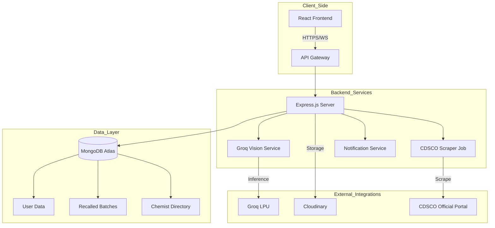

# MediGuard 🛡️ — AI-Powered Pharmaceutical Integrity Platform

[](https://github.com/mohdaaftab034/mediguard-4)
[](https://nodejs.org/)
[](https://reactjs.org/)
[](https://groq.com/)

**MediGuard** is a next-generation security ecosystem designed to combat the global counterfeit medicine crisis. By combining **advanced neural vision analysis** with a **real-time regulatory sync**, MediGuard empowers users, chemists, and authorities to verify pharmaceutical authenticity in seconds.

---

## 🎥 Pitch Video
Demo Video: https://drive.google.com/open?id=1LvXlxNeVV8cJA5jwiEftgh-SNSXgrthK&authuser=2&t=5.68

---

## ✨ Core Pillars

### 👁️ Neural Vision Inspection
Utilizing high-performance **Groq Llama-3.2-11B Vision** models, the platform performs forensic-level analysis on medicine packaging. It detects micro-anomalies in typography, logo placement, hologram integrity, and color shifts that are invisible to the naked eye.

### 📊 Real-Time Regulatory Sync
Directly integrated with **CDSCO (Central Drugs Standard Control Organisation)** data streams. Every scan cross-references an internal database of officially recalled, substandard (NSQ), and spurious drug batches.

### 📍 Verified Chemist Network
A geospatial directory of pharmacies verified by local health authorities. Users can find authentic sellers nearby, while pharmacies caught selling counterfeits are flagged and blacklisted in real-time.

---

## 🚀 Key Features

- **Instant Authenticity Scan**: Upload a photo of any medicine strip for a comprehensive risk assessment.
- **Batch Verification**: Extract and verify Batch IDs and Expiry dates against official manufacturer records.
- **Automatic Incident Reporting**: Generates formal, legal-grade incident reports for detected counterfeits.
- **Dynamic Alerts**: Real-time notifications for new drug recalls and spurious drug alerts in your state.
- **Interactive Map**: Find verified chemists within a 2-5km radius using MongoDB Geospatial indexing.

---

## 🏗️ System Architecture

MediGuard follows a decoupled, service-oriented architecture designed for scalability and rapid AI inference.



---

## 🛠️ Technology Stack

| Layer | Technology |
| :--- | :--- |
| **Frontend** | React 18, Vite, TailwindCSS, Framer Motion, Axios |
| **Backend** | Node.js, Express.js, Mongoose |
| **Database** | MongoDB (Geospatial Indexing, Atlas Search) |
| **AI/ML** | Groq Llama-3.2-11B-Vision-Preview, OpenAI API |
| **Infrastructure** | Vercel (Frontend), Vercel/Node (Backend), Cloudinary (Images) |

---

## 📦 Project Structure

```text
├── Frontend/           # React + Vite application
│   ├── src/            # Components, Hooks, Services, Pages
│   └── public/         # Static assets
├── backend/            # Node.js + Express API
│   ├── config/         # DB and Cloudinary configurations
│   ├── controllers/    # Request handlers
│   ├── models/         # Mongoose schemas
│   ├── routes/         # API endpoint definitions
│   └── services/       # AI, Scraping, and External logic
└── README.md           # You are here
```

---

## 🏁 Getting Started

### 1. Prerequisites
- Node.js (v18+)
- MongoDB Atlas Account (or local instance)
- Groq API Key
- Cloudinary Account

### 2. Installation

#### Clone the Repository
```bash
git clone https://github.com/mohdaaftab034/mediguard-4.git
cd mediguard-4
```

#### Backend Setup
```bash
cd backend
npm install
# Create .env with MONGODB_URI, JWT_SECRET, GROQ_API_KEY, CLOUDINARY_URL
npm run dev
```

#### Frontend Setup
```bash
cd ../Frontend
npm install
# Create .env with VITE_API_BASE_URL
npm run dev
```

---

## 📖 Detailed Documentation

For specific implementation details, refer to the module-level READMEs:
- 📂 [**Backend Technical Guide**](./backend/README.md) - API endpoints, JSON schemas, and server architecture.
- 📂 [**Frontend UI Guide**](./Frontend/README.md) - Component lifecycle, state management, and 3D integration.

---

## ⚖️ License
Distributed under the MIT License. See `LICENSE` for more information.

---

Developed with ❤️ by the MediGuard Team.
