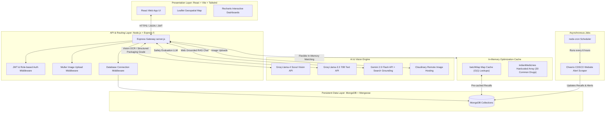

# 🚨 MediGuard — Technical System Analysis & Architecture
> **Aminabad Wholesale Dawa Bazar Context (Lucknow, UP)**
> 
> *An engineering-focused analysis of MediGuard's system architecture, persistent collections database schemas, feature-level workflows, in-memory caching strategies, and time/space complexities.*

---

## 📖 Table of Contents
1. [System Architecture](#-system-architecture)
2. [Database Design & Collections](#-database-design--collections)
3. [Deep-Dive Feature Analyses & Workflows](#-deep-dive-feature-analyses--workflows)
4. [Space & Time Complexity Analysis](#-space--time-complexity-analysis)
5. [Efficiency Assessment](#-efficiency-assessment)
6. [Tech Stack & Tooling](#-tech-stack--tooling)
7. [Installation & Run Guide](#-installation--run-guide)

---

## 📐 System Architecture

MediGuard utilizes a robust multi-layered architecture separating client presentation, secure server orchestration, in-memory caching, and asynchronous AI vision pipelines.



### ⚡ Architectural Flow of Key Pipelines:
1. **Core Verification Flow**:
   - The React client sends an image of a medicine container or wholesale invoice to the server.
   - The backend processes the upload via `Multer` and stores it securely in `Cloudinary`.
   - The remote image URL is sent through our multi-layered **Groq Vision / LLM Pipeline** or **Invoice Analysis Engine**.
   - Concurrently, the extracted batch numbers are matched against an **In-Memory Cache Map** for an instant sub-millisecond hit/miss response, falling back to a structured MongoDB indexed query.
   - Resulting scores and AI-graded diagnostics are saved in MongoDB and returned as real-time feedback to the client.

2. **Asynchronous Scraping Flow**:
   - The `node-cron` daemon triggers a Cheerio scraper every 6 hours.
   - It crawls CDSCO (Central Drugs Standard Control Organisation) notification portals.
   - Substandard, recalled, or spurious drugs are compiled, de-duplicated using regex-based title matching, and inserted directly into the `Alert` and `BatchNumber` collections.

---

## 🗄️ Database Design & Collections

MediGuard leverages **MongoDB** via **Mongoose** as its primary persistent database. It is engineered with strict schema designs, unique indices, compound indices, and text index definitions to handle high-frequency searches, geo-queries, and relational audits without performance degradation.

### 💾 Database Fallback in Development
To ensure seamless onboarding, a local **In-Memory MongoDB Server (`mongodb-memory-server`)** is integrated. If a `MONGODB_URI` environment variable is not defined in non-production environments, the backend spins up a temporary virtual database instance automatically, seeding mock records on-the-fly.

---

### 🗂️ Collection Profiles

#### 1. `User`
* **Purpose**: Manages secure identity records for general consumers, local chemists, and administrators.
* **Fields**: Name, email (lowercase, unique, indexed), hashed password, phone, role (`public`, `chemist`, `admin`), saved medicines, notification preferences (email/push/SMS), and security refresh tokens.
* **Key Indexes**: `{ email: 1 }` (unique index).

#### 2. `Scan`
* **Purpose**: Stores records of medicine image scans, packaging audits, and final safety verdicts.
* **Fields**: Associated user ID, Cloudinary image URLs, AI confidence score, visual concerns, recommended steps, extracted medicine details (name, generic name, manufacturer, license), batch status, geolocation coordinates, and conversation chat histories.
* **Key Indexes**:
  * `{ user: 1, createdAt: -1 }` (Optimizes rapid history retrieval for a logged-in user).
  * `{ result: 1 }` (Optimizes dashboard metric counting).
  * `{ 'medicineDetails.name': 1 }` (For fast lookup by drug name).
  * `{ createdAt: -1 }` (For global feeds).

#### 3. `BatchNumber`
* **Purpose**: Tracks substandard, recalled, or under-investigation drug batches officially flagged by CDSCO and state drug departments.
* **Fields**: Batch number (uppercase, trimmed, unique, indexed), drug brand name, manufacturer, expiry, current safety status (`RECALLED`, `UNDER_INVESTIGATION`, `NOT_LISTED`), recall details, and affected regions.
* **Key Indexes**:
  * `{ batchNumber: 1 }` (Primary unique index for O(1) in-memory population).
  * `{ status: 1 }` (Optimizes active recall listings).
  * `{ batchNumber: 1, status: 1 }` (Compound index for lightning-fast conditional lookups).
  * `{ medicine: 'text', manufacturer: 'text' }` (Text index enabling fuzzy search for matching drugs).

#### 4. `Supplier`
* **Purpose**: Stores verified B2B wholesale medicine distributors in Uttar Pradesh, especially within Aminabad Dawa Bazar, Lucknow.
* **Fields**: Registered business name, GSTIN (15-character formatted, unique, uppercase, indexed), drug license number, registered address, authorization status, and blacklist flags with reasons.
* **Key Indexes**: `{ gstin: 1 }` (Optimizes supplier verification upon wholesale invoice analysis).

#### 5. `Invoice`
* **Purpose**: Maintains records of wholesale transactions analyzed during B2B audits.
* **Fields**: Invoice number, supplier GSTIN, buyer ID, extracted invoice line-item batches, composite verification score (0-100), warning flags, and image references.
* **Key Indexes**: `{ invoiceNumber: 1, supplierGstin: 1 }` (Compound index preventing duplicate transaction audits and facilitating prompt lookups).

#### 6. `Chemist`
* **Purpose**: Stores verified chemist shop profiles and geographic coordinates to display trusted neighborhood pharmacies.
* **Fields**: Associated user ID, shop license, verified status, coordinates (latitude, longitude), user rating, blacklisting status, operating hours, and license uploads.
* **Key Indexes**: Coordinates are mapped for rapid radial bounding-box queries during user geolocation lookups.

#### 7. `Alert`
* **Purpose**: Stores drug recall notifications scraped from CDSCO websites or manually entered by admins.
* **Fields**: Title (indexed), description, severity level (`LOW`, `MEDIUM`, `HIGH`, `CRITICAL`), affected medicine/manufacturer, batch numbers, action required, and source link.
* **Key Indexes**: `{ title: 1 }` (Ensures scraper de-duplication).

---

## 🔍 Deep-Dive Feature Analyses & Workflows

### 🛡️ Feature 1: Multi-Layered AI Medicine Vision Scan (`/scanner`)
This is the core pipeline that assesses a physical drug box for counterfeiting risks.

```
📷 Image Upload 
      │
      ▼
☁️ Cloudinary Hosting ────────► Fetch Image as Base64 Buffer
                                        │
                                        ▼
                   🧠 LAYER 1 & 2: Vision Model (Llama-4 Scout)
                        ├── OCR Extraction: Brand, Generic, Manufacturer, Batch, Expiry, DL
                        └── Quality Check: Font Alignment, Tampering, Color, Security Hologram
                                        │
                                        ▼
                   🔬 BATCH AUDIT: In-Memory Map / Indexed MongoDB
                        └── Compares extracted batch to official CDSCO recalled lists
                                        │
                                        ▼
                   🧠 LAYER 3: Reasoning Model (Llama-3.3 70B)
                        ├── Evaluates OCR discrepencies & active recall status
                        └── Outputs Patient Safety Verdict & Risk Rating
                                        │
                                        ▼
                  📍 GEO-COMMUNITY: 2D Bounding Box Search
                        └── Locates 5 closest verified, non-blacklisted chemists
```

* **Data Store Operations**: Reads `BatchNumber` and `Chemist`; Writes to `Scan` collection.
* **Implementation Detail**: 
  - Uses `meta-llama/llama-4-scout-17b-16e-instruct` for vision-based OCR to ensure reliable character recognition.
  - Passes outputs to `llama-3.3-70b-versatile` to establish a reasoning barrier: this prevents fake-flagging due to minor print scratches while maintaining high alert thresholds for recalled batches.

---

### ⚡ Feature 2: Lightning-Fast Direct Batch Verification (`/batch-verify`)
Allows quick checks on manual batch inputs via an in-memory high-performance cache.
* **How It Works**:
  - Upon server boot, `loadBatchMap` fetches all active CDSCO `RECALLED` and `UNDER_INVESTIGATION` records from MongoDB.
  - It constructs an in-memory `Map` storing normalized, clean, lowercase, and exact versions of each recalled batch number mapped to its database record.
  - When a user enters a batch number:
    1. The API checks the in-memory `Map` (instantaneous hash lookup).
    2. If found, it returns immediate CDSCO danger warnings and hotlines.
    3. If missing from the map, it performs an indexed database lookup on `BatchNumber` to ensure absolute consistency.
* **Data Store Operations**: Reads in-memory `Map` (primary) and MongoDB `BatchNumber` (secondary fallback).

---

### 🧾 Feature 3: B2B Wholesale Invoice Audit (`/b2b-verify`)
Designed for retail chemists in Aminabad purchasing from distributors. It detects supply chain infiltration.
* **How It Works**:
  1. Retailer uploads an image of their purchase invoice alongside the physical medicine container.
  2. The **Invoice Vision Engine** extracts the distributor's GSTIN, invoice number, and line-item batches.
  3. The system checks the supplier:
     - Verifies the state code matches UP (`09`).
     - Performs an indexed search in `Supplier` to check authorization and blacklist status.
  4. The system validates the medicine:
     - Runs the **Medicine Vision Scan** on the container image to extract the batch number.
     - Fuzzy matches the physical batch against the list of batches printed on the invoice.
  5. Computes a composite **Trust Score (0-100)**:
     - **Supplier Credentials (40 points)**: Validates authorized UP GSTIN presence in our trusted directory.
     - **Invoice Authenticity (20 points)**: Verifies structured invoice tracking number and parsed line items.
     - **Batch Consistency (40 points)**: Verifies physical batch matches invoice line items, and that the batch is not blacklisted by CDSCO.
* **Data Store Operations**: Reads `Supplier`, `BatchNumber`; Writes `Invoice`, `Scan`.

---

### 💬 Feature 4: Grounded AI Medicine Assistant (`/medicine-info`)
Provides instant, trustworthy drug details and handles user inquiries.

```
🔎 User Searches Drug Name (e.g., "Dolo 650")
         │
         ├──► [FAST TRACK] In-Memory Search (Top 30 Common Indian Medicines)
         │       └── Found? Return instantly. (O(1) time)
         │
         └──► [FALLBACK 1] OpenFDA External API Search
                 ├── Fetches official drug properties and warnings
                 └── Upserts & caches result in MongoDB 'Medicine' collection
```

* **Conversational AI Q&A**:
  - Users can ask follow-up questions about side effects or usage.
  - The chat feature calls the **Gemini 2.0 Flash API** with **Google Search Grounding** enabled. 
  - This ensures responses contain accurate pricing (in INR) and recent CDSCO regulations, with automatic fallback to Groq if the Gemini API is offline.
* **Data Store Operations**: Reads/Writes `Medicine` collection.

---

### 📢 Feature 5: CDSCO Alerts & Scraper (`/alerts`)
Automates the collection of public drug warnings.
* **How It Works**:
  - Background scraper uses `cheerio` to fetch active PDF listings and alerts from the official CDSCO portal.
  - Matches text against keywords like `Substandard`, `Spurious`, and `Recall` to categorize severity.
  - Compares the title snippet against MongoDB `Alert` using a regex check to prevent duplicates.
  - Automatically loads highly structured seed data for historical major recalls (like *Paracetamol IP 500mg Batch BNE2401001* or *Dolo 650mg Batch SPR2024003*).
* **Data Store Operations**: Writes `Alert` and `BatchNumber`.

---

## 📊 Space & Time Complexity Analysis

Below is an engineering analysis of the time and space complexity of MediGuard's critical pathways.

| Feature / Operation | Database collections accessed | Time Complexity | Space Complexity | Efficiency Rating | Rationale & Bottlenecks |
| :--- | :--- | :--- | :--- | :--- | :--- |
| **Direct Batch Check** `(/batch-verify)` | `BatchNumber` | **O(1)** *(Map lookup)*<br>~~O(log B)~~ *(DB Fallback)* | **O(K)** *(Memory Map)*<br>~~O(B)~~ *(DB storage)* | **Exceptional** | Recalled batches are preloaded into server memory as a hash map. Constant lookup bypasses database roundtrips completely. |
| **Wholesale B2B Verify** `(/b2b-verify)` | `Supplier`, `BatchNumber`, `Invoice` | **O(T_vision)** + **O(log S)** + **O(I * P)** | **O(1)** *(Temporary)*<br>~~O(V)~~ *(DB logs growth)* | **High** | Dominated by AI vision model inference time (`T_vision`). Supplier lookup is extremely fast due to unique GSTIN indexing. Batch fuzzy match is a minor string comparison. |
| **Medicine Scan** `(/scanner)` | `Scan`, `BatchNumber`, `Chemist` | **O(T_vision)** + **O(1)** + **O(C)** | **O(1)** *(Temporary)*<br>~~O(H)~~ *(DB logs growth)* | **High** | Bounded by Groq API network latency for OCR and safety reasoning. The local chemist lookup uses a 2D coordinate bounding box check. |
| **Medicine Search** `(/medicine-info)` | `Medicine` | **O(1)** *(Local list match)*<br>~~O(T_network + log D)~~ *(FDA Fallback & cache)* | **O(1)** *(Local array)*<br>~~O(D)~~ *(Cache collection)* | **Very High** | Top 30 Indian medicines are resolved instantly from an in-memory array. External drug information queries are cached in MongoDB upon the first lookup. |
| **CDSCO Scraping** *(Background)* | `Alert`, `BatchNumber` | **O(N * log A)** *(N items, A alerts)* | **O(A)** *(Database size)* | **High** | Runs entirely in the background via cron. Regular regex de-duplication checks prevent database bloat. |

> *Note: Letters in Complexity formulas represent:*
> - `B`: Total batch records in MongoDB
> - `K`: Count of recalled/under-investigation batches
> - `S`: Total supplier records
> - `I`: Line items count on invoice
> - `P`: Length of physical batch string
> - `C`: Total registered chemists
> - `D`: Total cached medicines in database
> - `A`: Total existing alerts
> - `T_vision` / `T_network`: Extraneous network API roundtrip duration

---

## 📈 Efficiency Assessment

Is the database and lookup strategy efficient? **Yes, highly efficient.** Here is why:

### 1. The In-Memory Cache Shield
Instead of querying the database for every single batch verification, the system uses an **in-memory hash map** (`batchMap`). Since only *recalled* or *suspicious* batch numbers are stored in this map (representing a very small fraction of all medicines on the market), the memory footprint remains extremely low (`O(K)`) while lookup speeds remain at `O(1)` (sub-millisecond).

### 2. Strategic Database Indexing
For queries that cannot be resolved in memory, the database uses tailored indexes:
* **Supplier GSTIN Lookups**: Uses a unique, ascending index on `{ gstin: 1 }`, turning a potential collection scan into a rapid logarithmic binary tree search `O(log S)`.
* **Invoice Tracking**: Uses a compound index on `{ invoiceNumber: 1, supplierGstin: 1 }` to quickly check for duplicate audits.
* **Scan History**: Uses a compound index on `{ user: 1, createdAt: -1 }` to load user histories instantly, bypassing sorting bottlenecks.

### 3. Tiered Data Retrieval (Local ➔ MongoDB Cache ➔ Remote API)
When searching for medicines, the application uses a tiered model to minimize external API dependencies:
1. **Tier 1 (In-Memory)**: Checks the static list of the top 30 common Indian medicines.
2. **Tier 2 (MongoDB Cache)**: Queries the local `Medicine` database for previously fetched results.
3. **Tier 3 (External API)**: Queries the live OpenFDA API only as a last resort, saving the results back to the database for future searches.

### 4. Background Job Offloading
Heavy parsing tasks, such as CDSCO notification scraping, are scheduled to run in the background every 6 hours. This keeps the user-facing API fast and responsive.

---

## 🛠️ Tech Stack & Tooling

### Frontend
* **Core**: React 18, Vite
* **Styling**: Tailwind CSS, Framer Motion
* **Mapping**: Leaflet, React Leaflet (OSM integration)
* **Visuals**: Recharts (Interactive Admin/Chemist Analytics), Three.js / React Three Fiber
* **Icons & Feedback**: Lucide React, React Hot Toast

### Backend
* **Runtime & Framework**: Node.js, Express 5
* **Database**: MongoDB, Mongoose ODM
* **Security & Traffic Management**: JWT authentication, bcryptjs, Helmet, CORS, Morgan, Express Rate Limit
* **Storage Middleware**: Multer, Cloudinary
* **Job Scheduler**: node-cron, Axios, Cheerio

### AI Engine & Tools
* **Groq Vision API**: `meta-llama/llama-4-scout-17b-16e-instruct` (Invoice & medicine packaging OCR).
* **Groq Inference API**: `llama-3.3-70b-versatile` (Safety verdict classification and recommendations).
* **Gemini Developer API**: `gemini-2.0-flash` with active `google_search` grounding (Medical info RAG chat).

---

## 🚀 Installation & Run Guide

### Prerequisites
* Node.js 18 or newer
* MongoDB (Local instance or MongoDB Atlas Connection String)
* Groq API Key
* Gemini API Key *(Optional, for grounded web chat)*
* Cloudinary Account *(For saving scanned container images)*

### Step 1: Set Up and Run the Backend
1. Navigate to the backend directory and install dependencies:
   ```bash
   cd backend
   npm install
   ```
2. Create a `backend/.env` file with the following configuration:
   ```env
   PORT=5000
   CLIENT_URL=http://localhost:5173
   MONGODB_URI=mongodb://127.0.0.1:27017/mediguard
   
   JWT_SECRET=your_jwt_secret_key
   JWT_EXPIRES_IN=7d
   JWT_REFRESH_SECRET=your_refresh_secret_key
   JWT_REFRESH_EXPIRES_IN=30d
   
   GROQ_API_KEY=your_groq_api_key
   GEMINI_API_KEY=your_gemini_api_key
   
   CLOUDINARY_CLOUD_NAME=your_cloudinary_cloud_name
   CLOUDINARY_API_KEY=your_cloudinary_api_key
   CLOUDINARY_API_SECRET=your_cloudinary_api_secret
   
   ADMIN_EMAIL=admin@mediguard.in
   ADMIN_PASSWORD=Admin@123456
   ```
3. Start the backend developer server:
   ```bash
   npm run dev
   ```
   *Note: On startup, the server automatically seeds initial demo data (Suppliers, Chemist shops, and mock Users). To load the larger CDSCO recalled batch dataset, run the following command in your terminal:*
   ```bash
   npm run seed:batches
   ```

### Step 2: Set Up and Run the Frontend
1. Open a new terminal window, navigate to the Frontend directory, and install dependencies:
   ```bash
   cd Frontend
   npm install
   ```
2. Create a `Frontend/.env` file:
   ```env
   VITE_API_BASE_URL=http://localhost:5000/api/v1
   ```
3. Start the frontend developer server:
   ```bash
   npm run dev
   ```
4. Open your browser and navigate to `http://localhost:5173`.
5. Log in with the default admin account:
   * **Email**: `admin@mediguard.in`
   * **Password**: `Admin@123456`
