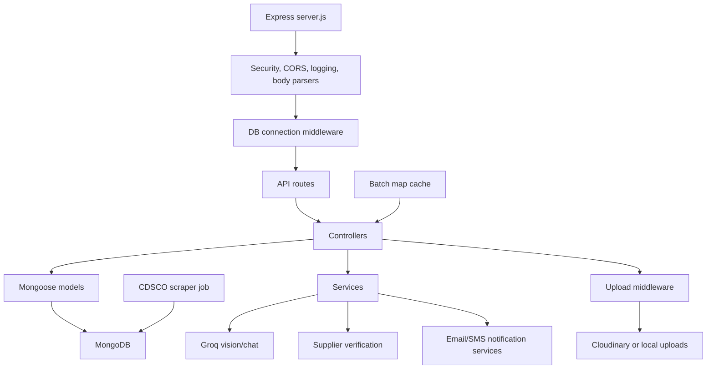

# MediGuard Backend

This backend is the API and verification layer for MediGuard. It handles auth, medicine scans, recalled batch lookup, wholesale invoice checks, supplier verification, reports, alerts, chemist records, and dashboard data.

## Architecture



How the main verification flow works:

1. `server.js` loads environment variables, connects to MongoDB, registers routes, and starts local-only jobs/seeding when not running serverless.
2. Uploaded medicine or invoice files pass through Multer. If Cloudinary is configured, files are stored remotely; otherwise local disk storage is used.
3. Groq services extract visible medicine fields, packaging quality signals, invoice GSTINs, invoice numbers, and batch numbers.
4. Batch numbers are checked first against an in-memory recalled-batch map for fast lookup, then MongoDB as fallback.
5. Wholesale verification combines GSTIN format checks, supplier database status, invoice data, physical batch matching, and medicine scan signals into a trust score.

## Main Folders

```text
backend/
  config/        DB, constants, Cloudinary setup
  controllers/   Request handlers and verification logic
  jobs/          CDSCO alert scraping jobs
  middleware/    Auth, role checks, rate limits, uploads, errors
  models/        Mongoose schemas
  routes/        Express route definitions
  services/      Groq, supplier, notification, email, SMS services
  utils/         Seed data, validators, response helpers
  server.js      Express app entry point
```

## API Route Groups

- `POST /api/v1/auth/register`, `POST /api/v1/auth/login`, profile, logout, refresh token, password flows
- `POST /api/v1/scan/analyze` for medicine image analysis
- `POST /api/v1/scan/chat` for follow-up medicine questions
- `GET /api/v1/scan/history` for logged-in user scan history
- `GET /api/v1/batch/verify?batch=...` for direct batch checks
- `GET /api/v1/batch/recalled` for recalled/under-investigation batches
- `POST /api/v1/wholesale/verify` for B2B invoice + medicine verification
- `GET /api/v1/chemists/nearby` plus chemist/admin verification routes
- `GET /api/v1/alerts` plus admin alert management routes
- `POST /api/v1/reports/submit` plus report history/admin routes
- `GET /api/v1/dashboard/public`, `/user`, `/chemist`, `/admin`
- `GET /api/health` for basic health check

## Data Models Used

- `User` - public, chemist, and admin users
- `Scan` - uploaded medicine scan results and AI analysis layers
- `BatchNumber` - recalled or under-investigation batch data
- `Supplier` - Aminabad/Lucknow supplier records with GSTIN and blacklist status
- `Invoice` - wholesale verification results
- `Chemist` - verified chemist profiles and locations
- `Alert` - CDSCO/static/scraped medicine safety alerts
- `Report`, `Notification`, `Medicine` - reporting, notification, and medicine lookup support

## Local Setup

Install dependencies:

```bash
cd backend
npm install
```

Create `backend/.env`:

```env
PORT=5000
CLIENT_URL=http://localhost:5173
MONGODB_URI=mongodb://127.0.0.1:27017/mediguard

JWT_SECRET=replace_with_a_long_secret
JWT_EXPIRES_IN=7d
JWT_REFRESH_SECRET=replace_with_another_long_secret
JWT_REFRESH_EXPIRES_IN=30d

GROQ_API_KEY=your_groq_api_key

CLOUDINARY_CLOUD_NAME=your_cloudinary_cloud_name
CLOUDINARY_API_KEY=your_cloudinary_api_key
CLOUDINARY_API_SECRET=your_cloudinary_api_secret

ADMIN_EMAIL=admin@mediguard.in
ADMIN_PASSWORD=Admin@123456
```

Start the API:

```bash
npm run dev
```

The API runs on `http://localhost:5000`.

Seed commands:

```bash
npm run seed
npm run seed:batches
```

`npm run dev` also runs the basic seed automatically in local mode. `seed:batches` loads the larger recalled/spurious batch dataset.

## Notes And Limitations

- The app has an in-memory MongoDB fallback in development, but using a real local/Atlas MongoDB URI is better for repeatable judging.
- Cloudinary is recommended for the medicine scanner because the scan controller expects a remote URL from the upload flow.
- Supplier and recall data are seeded/demo datasets, not a complete live government registry.
- CDSCO scraping can break if the public website structure changes, so static alert seed data is also included.
- Some report and dashboard paths are still demo-level and should be tightened before production use.
