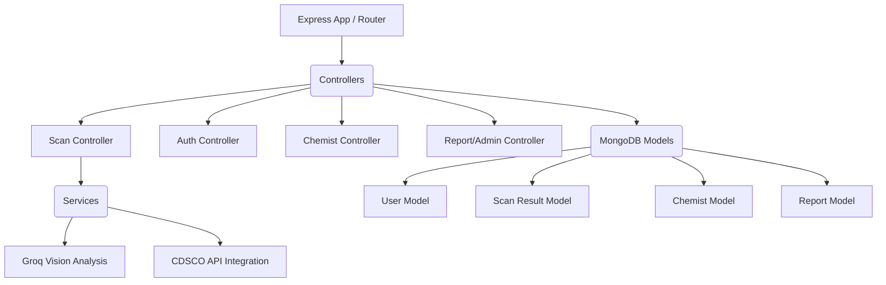

# MediGuard Backend Documentation

The backend system powers the core logic of MediGuard, providing RESTful endpoints, integrating with Groq Vision AI for image analysis, and managing data via MongoDB.

---

## 🏗️ System Architecture



---

## 📚 API Documentation

### 1. Authentication Endpoints

#### User Registration
- **Endpoint**: `POST /api/v1/auth/register`
- **Description**: Registers a new user.
- **Request Body (JSON)**:
  ```json
  {
    "name": "John Doe",
    "email": "john@example.com",
    "password": "SecurePassword123",
    "role": "public" 
  }
  ```
- **Response (201 Created)**:
  ```json
  {
    "success": true,
    "user": {
      "id": "64abcd123...",
      "name": "John Doe",
      "email": "john@example.com",
      "role": "public"
    },
    "token": "eyJhbGciOiJIUzI1NiIsInR5..."
  }
  ```

#### User Login
- **Endpoint**: `POST /api/v1/auth/login`
- **Description**: Authenticates an existing user and returns a JWT.
- **Request Body (JSON)**:
  ```json
  {
    "email": "john@example.com",
    "password": "SecurePassword123"
  }
  ```
- **Response (200 OK)**:
  ```json
  {
    "success": true,
    "token": "eyJhbGci...",
    "user": {
      "id": "64abcd123...",
      "name": "John Doe"
    }
  }
  ```

### 2. Scanning Endpoints

#### Analyze Medicine
- **Endpoint**: `POST /api/v1/scan/analyze`
- **Description**: Analyzes an uploaded image using Groq Vision.
- **Headers**: `Content-Type: multipart/form-data`
- **Request Body**:
  - `medicineImage`: [File]
- **Response (200 OK)**:
  ```json
  {
    "success": true,
    "scan": {
      "id": "scan123",
      "result": "GENUINE",
      "confidence": 98,
      "medicineDetails": {
        "name": "Paracetamol",
        "batchNumber": "AB1234"
      },
      "riskLevel": "LOW"
    }
  }
  ```

### 3. Chemist Verification Endpoints

#### Find Nearby Chemists
- **Endpoint**: `GET /api/v1/chemist/nearby`
- **Description**: Retrieves verified chemists near a specific location.
- **Query Parameters**: `lat=28.7041&lng=77.1025&radius=5`
- **Response (200 OK)**:
  ```json
  {
    "success": true,
    "chemists": [
      {
        "id": "chem123",
        "shopName": "Health Pharmacy",
        "location": {
          "coordinates": [77.1025, 28.7041]
        },
        "isVerified": true
      }
    ]
  }
  ```

---

## 🛠️ Setup & Execution

### Installation
1. Navigate to the backend directory:
   ```bash
   cd backend
   ```
2. Install dependencies:
   ```bash
   npm install
   ```

### Configuration
Create a `.env` file in the root of the `backend` directory:
```env
PORT=5000
MONGODB_URI=mongodb://localhost:27017/mediguard
JWT_SECRET=your_jwt_secret_key
GROQ_API_KEY=your_groq_api_key
```

### Running the Application
Start the development server:
```bash
npm run dev
```
The API will be available at `http://localhost:5000`.
